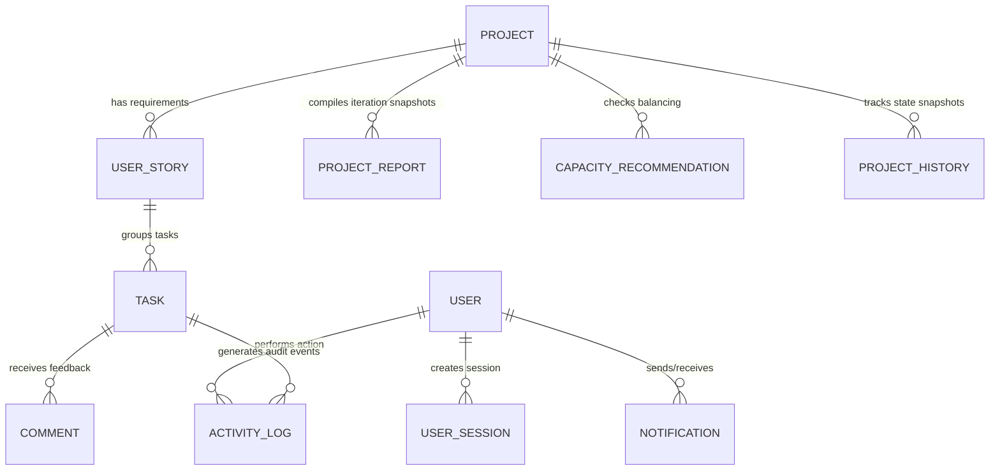

# AxisFlow Database Schema Documentation

The database utilizes SQLite through the Prisma ORM.

---

## 📐 Relational Model Entities
The schema models relational structures between:
- **`User`**: Account info containing role identifiers (`MANAGER`, `TEAM_LEADER`, `TEAM_MEMBER`).
- **`UserSession`**: Captures session expiration, active states, and login timestamps to satisfy audit security.
- **`Project`**: Root container containing status values.
- **`UserStory`**: Agile items representing user stories.
- **`Task`**: Iteration sub-items containing assigned developers, status, priority, and deadlines.
- **`ActivityLog`**: Historical log records mapping team events.
- **`ProjectReport`**: Snapshots of health scores and risks generated by workers.

---

## 🗄️ Relational Models Mapping

### User
Stores account profiles, credentials, and roles.
- `id` (String, UUID, PK)
- `email` (String, unique)
- `name` (String)
- `password` (String, hashed)
- `role` (String, "MANAGER" | "TEAM_LEADER" | "TEAM_MEMBER")
- `createdAt` (DateTime)

### UserSession
Tracks active sessions and login audit trails.
- `id` (String, UUID, PK)
- `userId` (String, FK -> User.id)
- `sessionId` (String, unique)
- `role` (String)
- `loginAt` (DateTime)
- `expiresAt` (DateTime)
- `isActive` (Boolean)

### Project
Tracks high-level milestones and deadlines.
- `id` (String, UUID, PK)
- `title` (String)
- `description` (String)
- `status` (String, "PLANNING" | "ACTIVE" | "COMPLETED")
- `createdAt` (DateTime)
- `deadline` (DateTime)

### UserStory
Agile backlog items assigned to specific Team Leaders.
- `id` (String, UUID, PK)
- `title` (String)
- `description` (String)
- `priority` (String, "LOW" | "MEDIUM" | "HIGH" | "URGENT")
- `status` (String, "BACKLOG" | "TODO" | "IN_PROGRESS" | "BLOCKED" | "COMPLETED")
- `assignedLeader` (String, maps to User.name)
- `deadline` (DateTime)
- `projectId` (String, FK -> Project.id)

### Task
Technical implementation units assigned to Team Members.
- `id` (String, UUID, PK)
- `title` (String)
- `description` (String)
- `assignedTo` (String, maps to User.name)
- `priority` (String)
- `status` (String, "TODO" | "IN_PROGRESS" | "BLOCKED" | "COMPLETED")
- `deadline` (DateTime)
- `storyId` (String, FK -> UserStory.id)

### Comment
Task discussion logs for developers.
- `id` (String, UUID, PK)
- `taskId` (String, FK -> Task.id)
- `content` (String)
- `author` (String)
- `createdAt` (DateTime)

### Notification
Dynamic alerts dispatched upon state changes or approaching deadlines.
- `id` (String, UUID, PK)
- `senderId` (String, FK -> User.id)
- `receiverId` (String, FK -> User.id)
- `title` (String)
- `message` (String)
- `type` (String, "INFO" | "WARNING" | "SUCCESS" | "ALERT")
- `isRead` (Boolean)
- `createdAt` (DateTime)

### CapacityRecommendation
Actionable workload balancing proposals calculated by background workers.
- `id` (String, UUID, PK)
- `projectId` (String)
- `taskId` (String)
- `taskTitle` (String)
- `fromDev` (String)
- `toDev` (String)
- `reason` (String)
- `status` (String, "PENDING" | "APPROVED" | "REJECTED")
- `createdAt` (DateTime)

### ProjectReport
Saved historical reports keeping the last 30 compiler outputs.
- `id` (String, UUID, PK)
- `projectId` (String, FK -> Project.id)
- `healthScore` (Int)
- `riskLevel` (String)
- `summary` (String, JSON text)
- `generatedAt` (DateTime)
