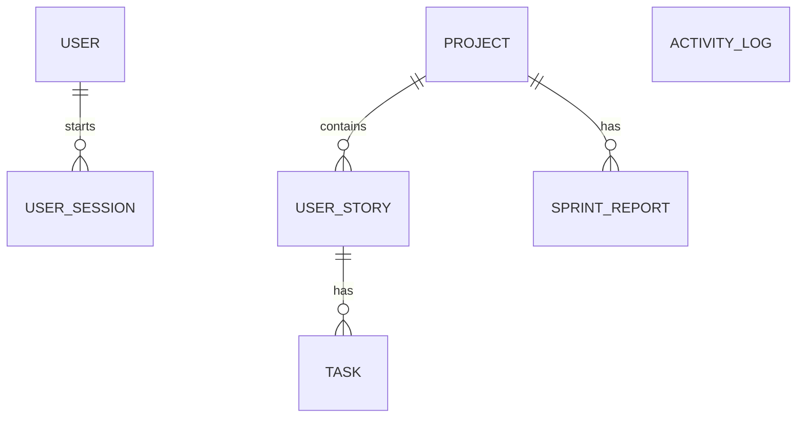

# SprintPulse - Smart Agile Project Management Platform

SprintPulse is a production-grade, role-based, full-stack agile planning dashboard tailored for software development teams. It enables engineering teams to manage projects, user stories, and tasks while utilizing a smart metrics engine that computes real-time sprint health, predicts milestone risks, detects resource bottlenecks, and generates cron-based reports.

---

## 🚀 Tech Stack

### Frontend
- **React (Vite)**: Component-driven fast rendering.
- **Tailwind CSS v3**: Utility-first CSS style layout.
- **Axios**: Promised-based client for REST API communication.
- **React Router v6**: Route guard and layout management.
- **Recharts**: Responsive data visualization.
- **Lucide React**: Vector icons.

### Backend
- **Node.js & Express.js**: REST API server.
- **SQLite**: Local relational database storage.
- **Prisma ORM**: Migration, seeding, and database queries.
- **Node Cron**: Background worker scheduler.

---

## ⚙️ Architecture & Design Decisions

### Monorepo Structure
The project operates as a clean monorepo separating `backend/` and `frontend/` directories:
1. **Backend**: Organizes logic into Controllers, Routes, Middleware, Services (Agile engines), and Background Workers.
2. **Frontend**: Organizes components by context, custom hooks, reusable elements, and route-level pages.

### Database Schema (SQLite + Prisma)
The schema models relational structures between:
- **`User`**: Account info containing role identifiers (`MANAGER`, `TEAM_LEADER`, `TEAM_MEMBER`).
- **`UserSession`**: Captures session expiration, active states, and login timestamps to satisfy audit security.
- **`Project`**: Root container containing status values.
- **`UserStory`**: Agile items representing user stories.
- **`Task`**: Sprint sub-items containing assigned developers, status, priority, and deadlines.
- **`ActivityLog`**: Historical log records mapping team events.
- **`SprintReport`**: Snapshots of health scores and risks generated by workers.



---

## 📝 Database Schema Documentation

### 1. `User`
Stores system accounts and corresponding login roles.
- `id` (String, Primary Key): Unique UUID.
- `email` (String, Unique): User email address.
- `name` (String): User's full display name.
- `password` (String): Salted bcrypt-hashed password string.
- `role` (String): Access level (`MANAGER`, `TEAM_LEADER`, `TEAM_MEMBER`).
- `createdAt` (DateTime): Auto-generated account creation timestamp.

### 2. `UserSession`
Session tracking table for compliance audits.
- `id` (String, Primary Key): Unique UUID.
- `userId` (String, Foreign Key): Linked user account.
- `sessionId` (String, Unique): Unique identifier matching decoded JWT properties.
- `role` (String): Role active during this session.
- `loginAt` (DateTime): Login timestamp.
- `expiresAt` (DateTime): Hard expiration marker (20 mins).
- `isActive` (Boolean): Flag representing active status.

### 3. `Project`
Root software release/development container.
- `id` (String, Primary Key): Unique UUID.
- `title` (String): Name of project.
- `description` (String, Optional): Scope descriptions.
- `status` (String): Current milestone stage (`PLANNING`, `ACTIVE`, `ON_HOLD`, `COMPLETED`).
- `createdAt` (DateTime): Auto-generated timestamp.

### 4. `UserStory`
Agile requirements/features.
- `id` (String, Primary Key): Unique UUID.
- `title` (String): Story name.
- `description` (String, Optional): Acceptance criteria.
- `priority` (String): Importance rating (`LOW`, `MEDIUM`, `HIGH`, `URGENT`).
- `status` (String): Kanban columns (`BACKLOG`, `TODO`, `IN_PROGRESS`, `BLOCKED`, `COMPLETED`).
- `projectId` (String, Foreign Key): Parent project container.

### 5. `Task`
Development task breakdown.
- `id` (String, Primary Key): Unique UUID.
- `title` (String): Task title.
- `description` (String, Optional): Assignment instructions.
- `assignedTo` (String, Optional): Developer name/email.
- `priority` (String): Task priority.
- `status` (String): Columns (`TODO`, `IN_PROGRESS`, `BLOCKED`, `COMPLETED`).
- `deadline` (DateTime): Task target completion date.
- `storyId` (String, Foreign Key): Parent user story requirement.

### 6. `ActivityLog`
Chronological activity streams.
- `id` (String, Primary Key): Unique UUID.
- `action` (String): Action tags.
- `performedBy` (String): Performer email string.
- `entityType` (String): Modified item types (`PROJECT`, `USER_STORY`, `TASK`, etc.).
- `entityId` (String): Reference ID of changed target.
- `timestamp` (DateTime): Action logged time.

### 7. `SprintReport`
Historic snapshots compiled by node-cron worker.
- `id` (String, Primary Key): Unique UUID.
- `projectId` (String, Foreign Key): Associated project container.
- `healthScore` (Int): Computed score (0-100).
- `riskLevel` (String): Categorization level (`HEALTHY`, `AT_RISK`, `CRITICAL`).
- `summary` (String): Detailed JSON log properties.
- `generatedAt` (DateTime): Compilation timestamp.

---

## 🔗 API Documentation

All request paths are prefixed with `/api`. Response content is returned in application/json formats.

| Endpoint | Method | Role Restrictions | Description |
| :--- | :---: | :--- | :--- |
| `/auth/login` | POST | Public | Authenticates credentials, saves HttpOnly JWT cookie, inserts audit `UserSession` entry. |
| `/auth/logout` | POST | Authenticated | Clears cookies, updates session record `isActive` state to false. |
| `/auth/me` | GET | Authenticated | Decodes JWT cookie payload and returns current session validation info. |
| `/auth/sessions` | GET | `MANAGER` | Fetches last 50 session audit logs (login timestamps, active states). |
| `/projects` | GET | Authenticated | Lists all projects. |
| `/projects/:id` | GET | Authenticated | Retrieves detailed project details with corresponding stories and tasks. |
| `/projects` | POST | `MANAGER` | Creates a new project container. |
| `/projects/:id` | PUT | `MANAGER`, `TEAM_LEADER` | Updates metadata details (title, description, status). |
| `/projects/:id` | DELETE | `MANAGER` | Deletes a project along with cascading relations. |
| `/stories` | GET | Authenticated | Retrieves user stories for a project query (`?projectId=`). |
| `/stories` | POST | `MANAGER`, `TEAM_LEADER` | Creates a user story. |
| `/stories/:id` | PUT | `MANAGER`, `TEAM_LEADER` | Modifies story fields (priority, status). |
| `/stories/:id` | DELETE | `MANAGER` | Deletes a user story. |
| `/tasks` | GET | Authenticated | Retrieves tasks under user story query (`?storyId=`). |
| `/tasks/my` | GET | Authenticated | Lists tasks assigned to the active user profile name or email. |
| `/tasks` | POST | `MANAGER`, `TEAM_LEADER` | Creates and assigns tasks. |
| `/tasks/:id` | PUT | Authenticated | Modifies task. Team members are restricted to modifying `status` and `priority` on their assigned tasks. |
| `/tasks/:id` | DELETE | `MANAGER`, `TEAM_LEADER` | Deletes a task. |
| `/reports` | GET | `MANAGER`, `TEAM_LEADER` | Retrieves generated reports history. |
| `/reports/trigger` | POST | `MANAGER`, `TEAM_LEADER` | Triggers immediate real-time report generation and prunes old ones. |
| `/analytics/dashboard` | GET | Authenticated | Computes health metrics. Team members are restricted to viewing their own workload. |

---

## 🔒 Security & Role-Based Access Control (RBAC)

Authentication is enforced using JSON Web Tokens (JWT) stored in secure, **HttpOnly** cookies expiring in 20 minutes (sliding window resets on request activity).
Permissions are segmented across three core roles:

1. **`MANAGER`**: Full platform authority. Can read/write/delete all projects, stories, and tasks. Access to global dashboards, workload balancer alerts, and security audit sessions.
2. **`TEAM_LEADER`**: Full planning capability. Can create/edit user stories, assign tasks to developers, and monitor health dashboards. Restricted from deleting projects.
3. **`TEAM_MEMBER`**: Developer-focused dashboard. Sees only their assigned tasks. Can only update task status and priority. Restricted from reading reports, workload balances of other members, or deleting items.

---

## 🧠 Smart Metrics Engine Algorithms

### 1. Sprint Health Score
Calculates a numerical score out of 100 representing project progression.
$$\text{Health Score} = \max(0, \min(100, (C_{ratio} \times 40 + S_{ratio} \times 35 + 25) - \text{Overdue Penalty} - \text{Blocked Penalty}))$$
- **Overdue Penalty**: $-10\%$ per overdue task (incomplete and deadline < now), up to max $-30\%$.
- **Blocked Penalty**: $-15\%$ per blocked user story / task, up to max $-30\%$.
- **Classifications**: 🟢 Healthy ($\ge 80$), 🟡 At Risk ($50-79$), 🔴 Critical ($< 50$).

### 2. Sprint Risk Predictor
Detects delivery risks:
- Overdue tasks $> 20\%$ of active tasks.
- Any blocked stories.
- Deadlines within 48 hours for incomplete tasks.
- High workload imbalance among developers.

### 3. Smart Workload Balancer
Weights developer workloads by task count and priority:
- Low = 1 pt, Medium = 2 pts, High = 3 pts, Urgent = 5 pts.
- If a developer's workload $\ge 2 \times$ the average of other developers, the engine recommends moving specific lower-priority tasks with deadlines furthest out to under-allocated developers.

### 4. Background Worker (Node-Cron)
Runs every minute to generate project `SprintReport` snapshots.
- **Pruning**: Automatically deletes historical reports beyond the last 30 entries per project to prevent SQLite storage bloat.
- **Retry Handling & Failure Recovery**: Operations wrapped in try-catch with exponential backoff. In case of SQLite database locking during concurrent writes:
  1. The cron catches database errors and schedules a retry after 2 seconds.
  2. If the retry fails, it attempts a third time after 4 seconds.
  3. If all 3 attempts fail, the error is written to console diagnostics and the cron yields until the next scheduled minute.

---

## 🛠️ Installation & Setup

### Prerequisites
- Node.js (v18+) and npm installed.

### 1. Clone & Install Dependencies
From the root workspace directory, run:
```bash
# Install dependencies for both frontend and backend automatically
npm run install:all
```

### 2. Run Database Migrations & Seeding
```bash
cd backend
npx prisma migrate dev --name init
npm run db:seed
cd ..
```

### 3. Running the Application Locally
You will need two terminal instances:

*Terminal 1 (Backend API):*
```bash
npm run start:backend
```

*Terminal 2 (Frontend React/Vite):*
```bash
npm run start:frontend
```

Once running, navigate to `http://localhost:5173` in your browser.

---

## 🔑 Demo Access Profiles

Use the fast login buttons on the login screen or these credentials:
- **Manager**: `manager@sprintpulse.com` / `password123`
- **Team Leader**: `leader@sprintpulse.com` / `password123`
- **Team Member**: `member1@sprintpulse.com` / `password123`

---

## 📝 Trade-offs & Design Decisions
- **SQLite Database**: Chosen for zero-setup execution, eliminating the need for Docker or PostgreSQL containers in development environments. Scalability is traded off for simple configuration.
- **Express + JWT Cookies**: Chose cookie-based tokens (HttpOnly) rather than LocalStorage to prevent XSS-based session interception.
- **Node Cron**: Background processing runs inside the main Express process. For high-scale apps, a queue processor like BullMQ with a separate worker instance and Redis should be used.

---

## 🤖 AI Usage Notes
This application was entirely designed, implemented, and audited using Google DeepMind's Antigravity AI agent. Code structuring, security RBAC middlewares, DB schemas, math formulas for health calculation, and responsive layout interfaces were generated and pair-programmed collaboratively.

---

## 🔮 What to Improve or Build Next
1. **Third-Party Integration Hooks**: Add Slack/Discord webhooks to notify team leaders immediately when tasks become blocked or a high workload imbalance occurs.
2. **Sub-tasks & Checklist Items**: Expand the `Task` model to support nested child sub-tasks for detailed item breakdowns.
3. **Database Migration to PostgreSQL**: Configure production configurations for seamless migration from SQLite to AWS RDS / Neon Postgres.
